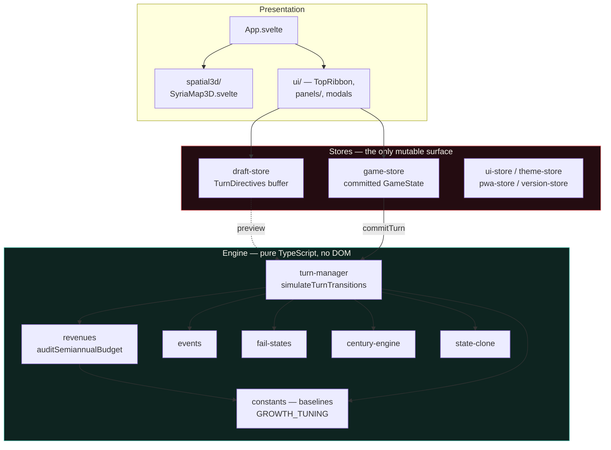
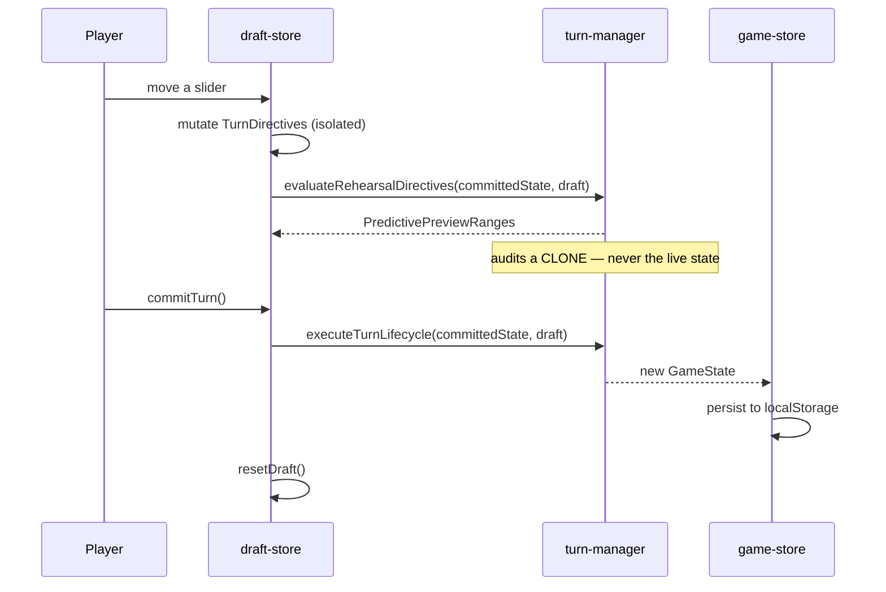
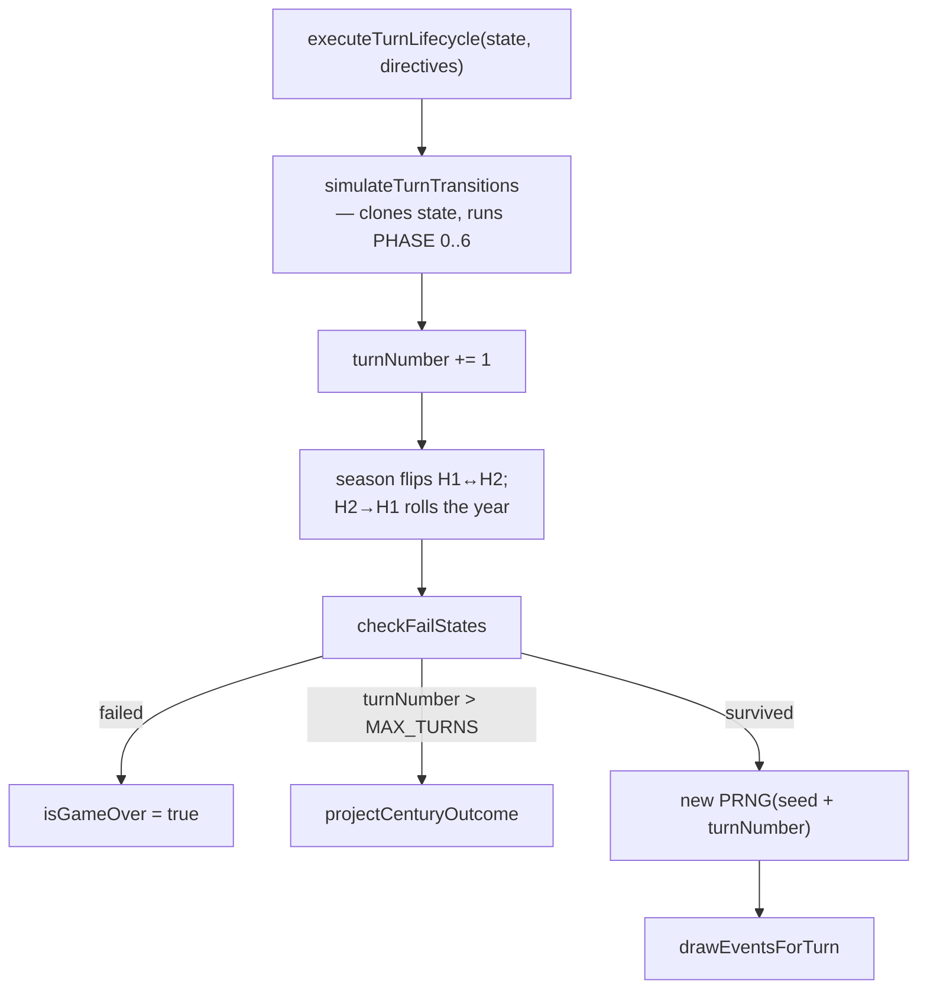

# Architecture

How the system is put together, where state lives, and what actually happens
during a turn.

## Layer map

The critical boundary is the **engine ↔ stores** line. Everything below it is
headless and pure; everything above it is Svelte. `plan/11` states this as
immutable principle #1 and #2, and it is the reason the test suite can import
engine modules directly.

## Module responsibilities

### `src/lib/engine/`

| File | Responsibility |
| :--- | :--- |
| `types.ts` | All type declarations. No runtime code. |
| `constants.ts` | Every baseline and tuning number. No functions. |
| `baseline.ts` | `createInitialGameState(seed)` — assembles turn 1 from constants. |
| `prng.ts` | Mulberry32. The **only** source of randomness in the game. |
| `state-clone.ts` | The single `GameState` deep-clone. See [below](#why-one-clone-helper). |
| `turn-manager.ts` | The turn body. Largest and hottest file. |
| `revenues.ts` | `auditSemiannualBudget` — the fiscal engine. |
| `events.ts` | Draw, validate and resolve event cards. |
| `spatial.ts` | Unrest contagion, inter-provincial migration, southern front. |
| `facilities.ts` | Concessional facility tranches (IMF / Gulf / Iran). |
| `fail-states.ts` | Five terminal failure conditions. |
| `century-engine.ts` | Post-survival ending selection. |
| `currency.ts` | FX depreciation, real wage, dual-currency affordability, auction. |
| `oligarch-helpers.ts` | Confiscated-asset settlement / liquidation math. |
| `deck/` | 10 event files, 68 cards total. Data only. |

### `src/lib/stores/`

| File | Responsibility |
| :--- | :--- |
| `game-store.ts` | Owns the committed `GameState`. The only writer. Persists to `localStorage`. |
| `draft-store.ts` | Owns uncommitted `TurnDirectives`, the turn budget, and the derived preview. |
| `ui-store.ts` | Drawer/modal stage, panel selection. |
| `theme-store.ts` | Active theme id. |
| `pwa-store.ts` | Install prompt, standalone detection, fullscreen. |
| `version-store.ts` | Service-worker update lifecycle. |

## State and the draft buffer

Two separate stores hold two separate objects. This split is the whole basis of
the "rehearse freely, commit permanently" contract.

**The preview must never mutate the committed state.** `auditSemiannualBudget`
is a *reporting* pass that also settles three derived macro values
(`taxCompliancePct`, `gridCapacityMW`, `civilServiceHeadcount`) onto whatever
state it is handed. `evaluateRehearsalDirectives` therefore passes
`cloneGameState(state)`. Before that was fixed, merely rendering a preview
inflated grid capacity by ~399 MW per re-evaluation and permanently ratcheted
civil-service headcount downward; a 400-run randomised sweep measured the
corruption on 399 of 400 playthroughs.

`scripts/test-dollar-auction.ts` and `scripts/test-event-effects.ts` guard the
two invariants that are easiest to break silently.

## Why one clone helper

Three different deep-clone idioms existed at one point, and two of them were
unsafe:

| Idiom | Problem |
| :--- | :--- |
| `JSON.parse(JSON.stringify(x))` | Silently maps `NaN`/`Infinity` to `null`, so numeric corruption propagates invisibly into a saved game. |
| `structuredClone(x)` | Throws `DataCloneError` on functions. Event cards can still carry `triggerCondition`. |
| `cloneGameState(x)` | Current. Drops functions, coerces non-finite numbers to 0 and **warns with the offending paths**. |

`cloneGameState` is used by both `turn-manager.ts` (turn simulation) and
`game-store.ts` (event resolution + persistence), so the two paths cannot drift.

## The turn lifecycle

`executeTurnLifecycle` (`turn-manager.ts`) is the public entry point. It is two
phases: the body, then the clock.

### Inside `simulateTurnTransitions` (PHASE 0..6)

| Phase | Lines | What it does |
| :--- | :--- | :--- |
| clone | ~191 | `cloneGameState(currentState)` |
| 0 | 195-344 | One-time decrees, political actions, special-case flags |
| 0B | 352-389 | Populist patronage: grant, charity fund, import surge |
| 1 | 391-433 | Oligarch decisions, property restitution |
| 2 | 435-482 | Foreign loans, sovereign mortgages, brain-gain |
| 3 | 484-532 | Geopolitics and the southern theatre |
| 4 | 534-651 | Provincial projects, demining, power boost, grid CapEx |
| 5 | 669-840 | **Financial audit**, facilities, loan terminations, FX auction, FX rate |
| 6 | 855-900 | Migration, population, local PRRI, tiers, contagion |

Line numbers drift; grep for the `PHASE n` banner comments.

### Ordering that matters

- **The audit runs at the end of PHASE 5**, after phases 0-4 have already
  mutated the clone. The rehearsal preview cannot reproduce that, because it
  audits an unmutated clone — so preview and commit differ slightly by design.
  `scripts/test-audit-split.ts` asserts a bound (<10% drift), not equality.
- **`netUSDDelta` is applied to reserves *after* the audit returns.** Anything
  that reads `reservesUSD` inside the audit is reading the opening balance. The
  runway metrics had this bug: they divided the opening balance and so reported
  `STABLE` at 1.2 months of true runway.
- **The FX rate is updated after reserves are settled**, so the rate function
  sees post-audit reserves while the receipt shows the delta that produced them.
- **The event draw happens last**, and its PRNG is seeded from
  `seed + turnNumber`. Nothing else consumes randomness, which is what makes a
  run reproducible from its seed.

## Failure model

`checkFailStates` runs once per turn, after the clock advances, and returns at
most one result in this order:

| # | Type | Condition (abbreviated) |
| :--- | :--- | :--- |
| 1 | `SOVEREIGN_INSOLVENCY` | `reservesUSD <= 0` |
| 2 | `URBAN_INSURRECTION` | `nationalRRI >= 80` and ≥4 governorates at `REVOLT` |
| 3 | `SECURITY_MUTINY` | real wage < $8 **and** `systemicCorruption > 75` |
| 4 | `BALKANIZATION_CASCADE` | Suwayda secession ≥85% and ≥2 autonomous-frontier revolts |
| 5 | `CRISIS_DEFAULT_COLLAPSE` | `politicalCapital <= 0` and `civicTrust <= 0` |

Notes worth knowing:

- Order matters: #5's first clause is unconditional on unrest, so it can preempt
  #2 and #4 in a state where both PC and trust are spent.
- #3 reads `civilServiceWageSYP` as the *soldier* wage. That is an intentional
  simplification, but the narration implies a military-specific figure.
- #1 is `<= 0` and reserves are floored at exactly 0, so any path that drains FX
  to zero fails immediately and silently.
- The fail check does **not** run in the preview path. A player can commit into
  terminal insolvency without a projected warning.

## Endings

Surviving `MAX_TURNS` triggers `projectCenturyOutcome`, a single if/else chain
over five scalars producing one of five national endings, plus three southern
sub-endings. It performs **no** year-by-year simulation.

`plan/04` and `plan/07` describe a 4-epoch, year-21-to-100 projection and 6
endings; `plan/04` also promises a "2D political compass of all 13 endings".
None of that is built. The current implementation is a scoring function, and its
gates have drifted from the spec (see `notes/facts/unmodelled-sectors.md`).
All 13 reachable endings are covered by `scripts/test-all-endings-comprehensive.ts`.

## Known architectural debts

1. **`turn-manager.ts` is ~1100 lines** and owns eight phases. It is the main
   obstacle to testing phases in isolation.
2. **The audit is not pure.** It reports *and* settles. Every caller must
   remember to hand it something disposable. The naming (`audit`) actively
   misleads here.
3. **Two parallel engines.** `evaluateRehearsalDirectives` and
   `simulateTurnTransitions` compute overlapping quantities by different routes.
   That is the root cause of the preview/commit drift.
4. **Dead code in the hot path.** `executeDollarAuction` and `adjustOfficialPeg`
   in `currency.ts` are unreachable, and `calculateProvincialPRRI` /
   `applyDemining` in `spatial.ts` are unreferenced by the turn engine. Their
   constants can silently disagree with the live inlined copies.
5. **`officialRateSYP` is never written.** The directive
   `officialRateAdjustment` exists, defaults to 0, and is read nowhere, so the
   "official peg" is a frozen display constant. In reality the central bank
   pursued a managed unpegging — see `notes/facts/monetary-reform-2026.md`.
