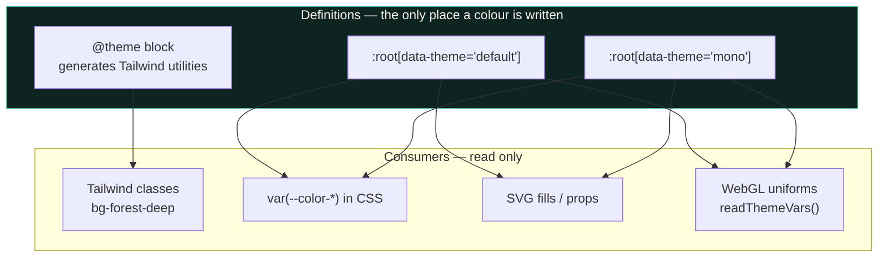

# Theming engine

How one set of colour definitions reaches CSS, Tailwind, inline SVG and a WebGL
canvas without any of them drifting.

## The core rule

> **Every colour value is defined exactly once, in `src/app.css`, as a CSS custom
> property. Everything else reads it.**

`src/lib/themes.ts` is only a *registry* — it names the themes and provides
helpers. It contains no colour values except the preview swatches, which
deliberately depict themes that may not be active and so cannot be read live.

## The three layers



### 1. The `@theme` block — generates Tailwind utilities

`src/app.css` declares `--color-forest-deep: #0a1b18;` and friends inside
`@theme { … }`. Tailwind v4 reads that block at build time and *generates the
matching utility classes*, so `bg-forest-deep` / `text-wheat-light` /
`border-umber-border` exist without ever being written out.

This is the idiomatic Tailwind v4 pattern: tokens in CSS, utilities generated,
no `tailwind.config.js` colour list to keep in sync.

### 2. `:root[data-theme="<id>"]` — the live override

```css
:root[data-theme='default'] {
  --color-forest-deep: #0a1b18;
  /* …every --color-* and --map-* token… */
}
```

Switching a theme is a **single attribute write**: `data-theme` on `<html>`. Every
custom property re-resolves, so every `var(--…)` and every generated utility
updates in the same frame with no re-render. The `default` block deliberately
repeats the `@theme` values so the two never need reconciling at read time.

### 3. JS readers — for colours computed in code

Anything drawn by JS rather than CSS needs the *current* value, resolved at the
moment of use:

| Function | Returns |
| :--- | :--- |
| `cssVar(name, fallback)` | One property as a string |
| `cssRgbTriplet(name, fallback)` | A `"r g b"` triplet as `[r, g, b]` |
| `themeStatusColors()` | `{ ok, warn, danger, info }` for map glyphs and badges |

`SyriaMap3D.svelte` has a `readThemeVars()` built on these; it re-reads on every
theme change and pushes the values into shader uniforms, so the 3D map restyles
without a reload.

## Token families

| Prefix | Purpose | Count |
| :--- | :--- | :--- |
| `--color-forest-*` | Deep green institutional base | 5 |
| `--color-wheat-*` | Light text/parchment | 4 |
| `--color-umber-*` | Alarm / deficit / crisis | 5 |
| `--color-charcoal-*` | Neutral chrome and shell | 5 |
| `--color-status-*` | Semantic status | 4 |
| `--color-danger-button` | Single destructive action colour | 1 |
| `--map-*` | Map canvas, ink, grid, arrows, selection | 14 |
| `--map-ramp-*` | `R g b` triplets for the PRRI health ramp | 3 |
| `--font-*` | Thmanyah Sans / Serif Display families | 4 |

The `--map-ramp-*` tokens are stored as **space-separated RGB triplets**, not
hex, because the map interpolates between them numerically. `cssRgbTriplet()`
parses them defensively: non-numeric parts are dropped, and fewer than three
surviving values falls back rather than producing `rgb(NaN, …)`.

## Avoiding flash-of-wrong-theme

Three coordinated pieces, because a theme read after first paint visibly flickers:

1. **Pre-paint inline script in `index.html`** stamps `data-theme` on `<html>`
   before the body renders, reading the same `localStorage` key.
2. **`initTheme()`** in `themes.ts` does the same job for the JS entry path,
   returning the active id.
3. **`<meta name="theme-color">`** is set per theme so the mobile browser chrome
   matches the app background.

`applyTheme(id)` writes the attribute and persists to
`localStorage['president-theme-v1']`; `storedTheme()` reads it back with an
`isThemeId()` guard, so a hand-edited or stale value falls back to `default`
instead of poisoning the stylesheet. Both localStorage access points are wrapped
in `try/catch` because private-mode browsers throw on access, and a theme that
fails to persist should still apply for the session.

## Adding a theme — three steps

No Svelte file needs to change.

1. Add the id to `ThemeId` in `themes.ts` and a `ThemeMeta` entry
   (`labelAr`, `labelEn`, `hint`, `swatches`).
2. Add a `:root[data-theme="<id>"] { … }` block in `app.css` overriding **every**
   `--color-*` and `--map-*` token. Copy the `mono` block as a template.
3. Add the id to `THEMES`.

```ts
export type ThemeId = 'default' | 'mono';   // 1
```

```css
:root[data-theme='mono'] {                 /* 2 */
  --color-forest-deep: #000000;
  --map-canvas: #000000;
  --map-ok: #00e600;
  /* every other token */
}
```

```ts
mono: { id: 'mono', labelAr: '…', /* … */ swatches: ['#000000', '…'] },  // 3
```

The `mono` theme is a real accessibility tool, not decoration: grayscale chrome
with pure red/green/yellow/blue status colours, for testing whether the UI
communicates without relying on the forest/wheat palette.

## Invariants

- **A colour is never written outside `app.css`.** The one exception is a
  `fallback` argument passed to `cssVar()`, which exists so a headless or
  pre-CSS context still has a sane value.
- **Swatches in `themes.ts` are a duplicate by necessity.** They depict inactive
  themes, so they cannot be read from live CSS. When editing a palette, update
  them in the same commit or the picker lies.
- **Adding a theme means overriding *every* token.** A partial override silently
  inherits the previous theme's values, which produces a palette that is a
  mixture of two designs and is very hard to spot in review.
- **`data-theme` is the only switch.** Never write a colour directly from a
  component; add a token instead.

## Known rough edges

- Token names encode *role* (`--color-umber-crimson`) rather than a scale, so
  there is no consistent ramp across families the way `--map-ramp-*` has one.
- The font tokens list the same two families under four names, with different
  fallbacks per usage, which is not obvious from the names.
- The picker's live previews read CSS, but the swatch squares do not, so a
  half-finished palette edit shows stale squares in the picker while the applied
  theme is already correct.
