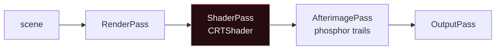

# Three.js map

The 3D governorate map, the CRT post-processing chain, and the render-loop
strategy. `SyriaMap3D.svelte` is ~1,830 lines and is the heaviest module in the
project.

## Why there are two maps

| File | Role |
| :--- | :--- |
| `spatial3d/SyriaMap.svelte` | 2D SVG sovereign vector map. The original. |
| `spatial3d/SyriaMap3D.svelte` | WebGL extruded-prism map with a CRT tube pass. Current. |
| `spatial3d/syria-2d-paths.ts` | SVG path data + hex coordinates, shared by both. |
| `spatial3d/syria-region-context.ts` | Generated geographic frame, sea/far-feature decoration. |

`plan/README.md` records that the Three.js hexagonal-prism map was originally
*replaced* by a 2D SVG map, and has since been brought back. Both files are live;
`plan/07` is superseded.

## Renderer

```ts
const renderer = new THREE.WebGLRenderer({ antialias: true });
```

Antialiasing is left at the default and no pixel ratio is set at construction —
DPR is applied later by the resize path, so a device-pixel change and an initial
layout are handled by one code path rather than two.

## The post-processing chain



```ts
const composer = new EffectComposer(renderer);
composer.addPass(new RenderPass(scene, camera));

const crtPass = new ShaderPass(CRTShader);
crtUniforms = crtPass.uniforms as unknown as typeof crtUniforms;  // pass clones
composer.addPass(crtPass);

const ghostPass = new AfterimagePass(CRT_DEFAULTS.uGhost);
ghostPass.enabled = false;        // off until the ghost slider leaves 0
composer.addPass(ghostPass);

composer.addPass(new OutputPass());
```

**The subtle line** is `crtUniforms = crtPass.uniforms`. `ShaderPass` **clones**
the shader's `uniforms` object, so the module-level `crtUniforms` stops being
authoritative the moment the pass is constructed. Reassigning it to
`crtPass.uniforms` is what keeps the live pass and any dev tooling in sync. Get
this wrong and slider changes appear to do nothing.

`AfterimagePass` is the phosphor-trail effect. It is created but kept
`enabled = false`, and only switched on when the ghost uniform exceeds a
threshold — an always-on afterimage pass costs a full-screen feedback read every
frame for no visible benefit at rest.

`OutputPass` goes last and performs the colour-space conversion. Without it the
CRT shader's output is written in the wrong space and the whole scene looks
washed out — this is a required last entry, not an optional extra.

## CRT uniforms

`CRT_DEFAULTS` is a single tuning block, and its comment says to bake chosen
values back into it once a tuning panel session settles. The live set:

| Uniform | Effect |
| :--- | :--- |
| `uBulge`, `uRadius` | Screen curvature |
| `uChroma` | RGB channel separation |
| `uScan` | Scanline intensity |
| `uPixel` | Aperture-grille / shadow-mask |
| `uMask` | Mask strength |
| `uStrobe` | Flicker |
| `uTint` | Colour cast |
| `uNoise` | Static |
| `uBloom` | Glow |
| `uRollH`, `uRollV`, `uRollSpeed` | Picture roll |
| `uJitter` | Vertical-hold instability |
| `uGhost` | Phosphor persistence (drives `AfterimagePass` damp) |

`uGhost` is the only one that is *not* consumed by the CRT shader itself — it
configures the separate afterimage pass. The pass toggles on
`crtPass.enabled && ghostPass.uniforms['damp'].value > 0.005`.

## The resize strategy

This is the most carefully written part of the file, and the reasoning is worth
preserving.

**Problem.** A side drawer animates open over 300ms. A naive
`ResizeObserver → renderer.setSize()` produces a blank or partially-drawn
canvas on every intermediate frame, because the drawing buffer is cleared and
redrawn before the CSS transition has settled.

**Solution.** `ResizeObserver` only *records* the latest size. The actual buffer
resize is **deferred into the render frame**:

```ts
const requestResize = () => {                 // observer callback: record only
  const rect = el.getBoundingClientRect();
  pendingW = Math.max(1, Math.round(rect.width));
  pendingH = Math.max(1, Math.round(rect.height));
  pendingDpr = Math.min(2, window.devicePixelRatio || 1);
};

const applyResize = () => {                   // frame loop: apply, once, just in time
  if (pendingW === curW && pendingH === curH && pendingDpr === curDpr) return;
  curW = pendingW; curH = pendingH; curDpr = pendingDpr;
  if (renderer.getPixelRatio() !== curDpr) {
    renderer.setPixelRatio(curDpr);
    composer.setPixelRatio(curDpr);
  }
  // …setSize + clear
};
```

Three properties fall out of this:

1. **No intermediate blank frames.** The buffer is cleared and redrawn in the
   same paint as the resize.
2. **DPR is only touched when it changes.** On a 2× display that halves a
   monitor move; a naive implementation reallocates the buffer on every pixel of
   a drag.
3. **The `cur*` triple makes the whole thing idempotent**, so a
   `ResizeObserver` that fires redundantly costs three integer comparisons.

`pendingDpr` is capped at 2. A 3× phone would otherwise allocate 9× the pixels
for a map that is a few hundred pixels of actual content.

## Theme integration

The map is WebGL, so CSS cannot reach it. The bridge is
`readThemeVars()` in `themes.ts`, re-run on every theme change:

```ts
themeVars = readThemeVars();   // on theme change
applyTheme();                   // push into shader uniforms + material colours
```

The same change handler calls `applyTheme()` immediately on mount as well, so the
first frame is already themed. See [theming.md](theming.md#js-readers--for-colours-computed-in-code).

## Geometry and data

| Source | Provides |
| :--- | :--- |
| `syria-2d-paths.ts` | `SYRIA_2D_GOVERNORATES` — 14 governorate SVG paths + `SYRIA_2D_VIEWBOX` |
| `syria-region-context.ts` | `SYRIA_BASE`, `REGION_SEA`, `REGION_NEAR`, `REGION_FAR`, far labels |
| `scripts/generate-syria-3d-data.py` | Precomputed 3D boundary polygons |
| `scripts/generate-region-context.py` | Regenerates `syria-region-context.ts` from the SVG |
| `scripts/process-syria-geojson.py` | Normalises source GeoJSON (merges Golan→Quneitra, splits Damascus / Rif Dimashq) |

The 3D data is **precomputed and committed** rather than generated at runtime —
deliberate, so the map does not depend on Python in any build path.

## Cost control

- The CRT pass is gated on `uiStore.crtTube`, so the whole chain can be skipped
  when a player turns it off.
- `AfterimagePass` stays disabled until its uniform justifies the cost.
- DPR capped at 2.
- The render loop applies at most one resize per frame regardless of how many
  observer callbacks fired.

## Known rough edges

- **No performance budget is documented.** There is no frame-time target, no
  adaptive quality, and no measurement of what the CRT pass costs on a low-end
  device.
- **`generate-syria-3d-data.py` and `process-syria-geojson.py` have no
  committed inputs** beyond the source GeoJSON, so the pipeline is not
  reproducible from the repo alone.
- The afterimage pass reads the whole framebuffer each frame when enabled; on
  integrated GPUs this is the most likely source of jank.
- `readThemeVars()` forces a `getComputedStyle` read per token per theme change.
  That is fine for discrete user actions and would be wrong in a hot loop.
